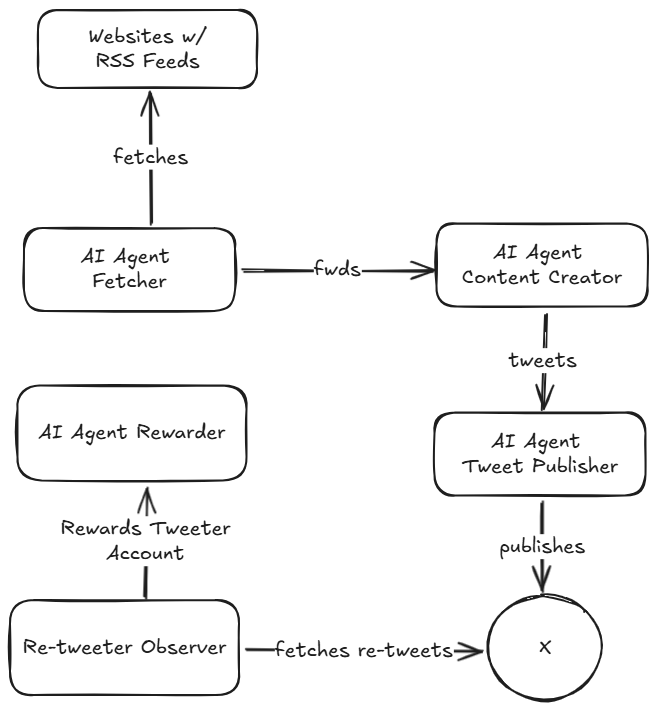

# Cuicui: An AI Agent that rewards you

The concept behind this PoC is an AI Agent that creates a daily digest of crypto news on Twitter and rewards anyone who re-tweets or likes the original tweet.

## Overall view



- An AI Agent Fetcher gets raw data from several web sites
- It forwards the data to an AI Agent, the content creator
- Then the content is passed on to the AI Tweet Publisher publishing the tweets to [X](https://x.com/)
- An Observer monitors the tweets (likes & retweets)
- The last AI Agent rewards accounts that have an ETH address on their bio

## Tooling

We will make use of:

- [Flowise](https://flowiseai.com/) a LLM orchestration using [Langchain](https://www.langchain.com/) and [LlamaIndex](https://www.llamaindex.ai/)
- A local LLM using [Ollama](https://ollama.com/)
- [DFNS](https://www.dfns.co/) as a wallet provider on the [Sepolia](https://sepolia.etherscan.io/) network
- [X](https://developer.x.com/en)

Everything will run locally. You make use of [Render](https://render.com/) to deploy this permanently.  
The choice is yours about the choice of the LLM, local [Ollama](https://ollama.com/), or remote like [OpenAI](https://openai.com/) or [Gemini](https://gemini.google.com/app)

## Installation

1. Download and install [Ollama](https://ollama.com/download)
2. On the command line, execute 
    ```
    ollama run llama3.2
    ```
    This is the model I used. You can choose any other model [there](https://ollama.com/search)
3. Install [Flowise](https://docs.flowiseai.com/getting-started) using the "For Developers" section - I am using version [2.1.3](https://github.com/FlowiseAI/Flowise/releases/tag/flowise%402.1.3)
4. Get an [X](https://developer.x.com/en) API key
5. Get yourself an account at [DFNS](https://www.dfns.co/product/wallets-as-a-service) or any other provider of your choice.
