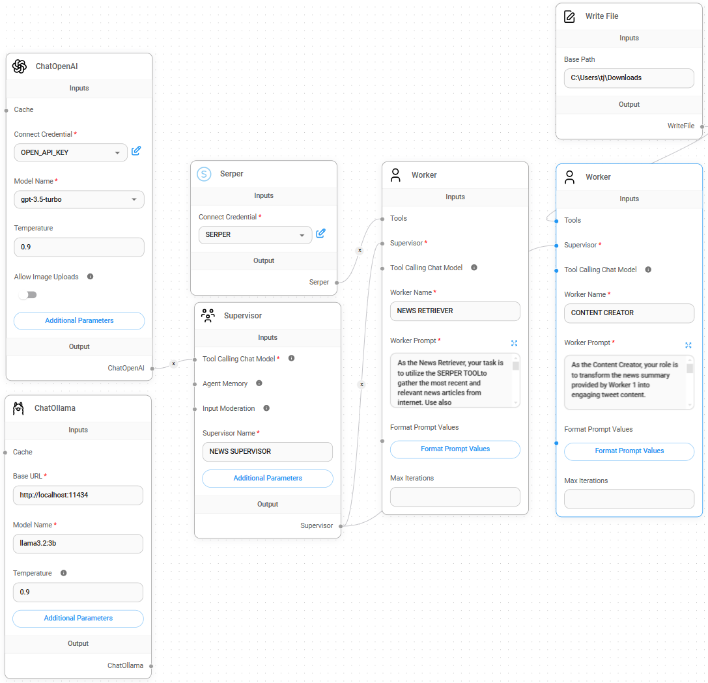

# Cuicui: An AI Agent that rewards you

The concept behind this PoC is an AI Agent that creates a daily digest of crypto news on Twitter and rewards anyone who re-tweets or likes the original tweet.  
"CuiCui" is how a [bird sounds](https://www.youtube.com/watch?v=pAubhURCXxU) in French.

## Overall view


- An AI Agent Fetcher gets raw data from several web sites
- It forwards the data to an AI Agent, the content creator
- Then the content is passed on to the AI Tweet Publisher publishing the tweets to [X](https://x.com/)
- An Observer monitors the tweets (likes & retweets)
- The last AI Agent rewards accounts that have an ETH address on their bio

## Tooling

We will make use of:

- [Flowise](https://flowiseai.com/) a LLM orchestration using [Langchain](https://www.langchain.com/) and [LlamaIndex](https://www.llamaindex.ai/)
- A local LLM using [Ollama](https://ollama.com/)
- [DFNS](https://www.dfns.co/) as a wallet provider on the [Sepolia](https://sepolia.etherscan.io/) network
- [X](https://developer.x.com/en)

Everything will run locally. You make use of [Render](https://render.com/) to deploy this permanently.  
The choice is yours about the choice of the LLM, local [Ollama](https://ollama.com/), or remote like [OpenAI](https://openai.com/) or [Gemini](https://gemini.google.com/app)

## Installation

1. Download and install [Ollama](https://ollama.com/download)
2. On the command line, execute 
    ```
    ollama run llama3.2
    ```
    This is the model I used. You can choose any other model [there](https://ollama.com/search)
3. Install [Flowise](https://docs.flowiseai.com/getting-started) using the "For Developers" section - I am using version [2.1.3](https://github.com/FlowiseAI/Flowise/releases/tag/flowise%402.1.3)
4. Get an [X](https://developer.x.com/en) API key
5. Get yourself an account at [DFNS](https://www.dfns.co/product/wallets-as-a-service) or any other provider of your choice. Create a ETH wallet.
6. Get the code from [https://github.com/tjdragon/cuicui](https://github.com/tjdragon/cuicui)

### Flowise
Flowise already supports a number of modules natively.  But if you'd like to add more, here is the how-do.  
I will show how to make the Javascript module "rss-parser" avaiable:

```script
cd Flowise && cd packages && cd components
pnpm add rss-parser
cd .. && cd ..
pnpm install
pnpm build
```

It will appaear in the packages/package.json: "rss-parser": "^3.13.0".  

Then we need to add it as a dependency using the env variable TOOL_FUNCTION_EXTERNAL_DEP: create a .env file under Flowise\packages\server:

```script
PORT=3001
TOOL_FUNCTION_EXTERNAL_DEP=rss-parser
```

Restart Flowise, and you will see the Flowise UI, with any dependancy added at [http://localhost:3001/](http://localhost:3001/)

## Step-By-Step Flowise Design

Please take this [Udemy Course](https://www.udemy.com/course/ai-agents-automation-business-with-langchain-llm-apps/) on Flowise: a practical, step-by-step tutorial!

### AI Agent to Fetch RSS News
Note that I am using a local LLM Chat Bot called Ollama. If you followed the instructions above, you can list your models from the command line:
```
ollama list

NAME           ID              SIZE      MODIFIED
llama3.2:3b    a80c4f17acd5    2.0 GB    24 hours ago
llama3.2:1b    baf6a787fdff    1.3 GB    46 hours ago
```

I will be using **llama3.2:3b**.

In order to get the news from a RSS web site, we are going to use a [Custom Document Loader](https://docs.flowiseai.com/integrations/langchain/document-loaders/custom-document-loader) using a bit of JavaScript code to fetch data and convert into a format that the document loader understands:

```javascript
const Parser = require('rss-parser');

const parser = new Parser();
const url = 'https://cointelegraph.com/rss/tag/blockchain';

const feed = await parser.parseURL(url);
return feed.items.map(item => ({
        pageContent:  item.link,
        metadata: {
            title: item.title, 
        }
}));
```

Design the following flow:



- It all starts with a **Supervisor** that takes in a LLM model (**ChatOllama** in my case running locally), you can substitue ChatOllama with OpenAI, Gemeni, BedRock, Anthropic etc
- The **Supervisor** links to a **Worker**, in my case, an AI agent called "NEWS FETCHER". This AI Agent has a prompt "You are a research assistant who gets the latest crypto news, digest the stories and headlines using https://cointelegraph.com/rss/tag/blockchain"
- The **Worker** ("NEWS FETCHER") uses a **Retriever Tool** that uses an **In-Memory Vector Store** using **Ollama Embeddings** being fed by my **Custom Document Loader** using the JavaScript code above

In order to test this first part, first upinsert the website data into Flowise Store by clicking on the green icon, upper-right corner, called "Upsert Vector Database" 

### AI Agent to Create Content for X

We need to add a second agent that will take the data from the first agent, creates content for X and post data to a local simulator.
But first, we will use OpenAi to generate prompts

#### Prompting
Use OpenAI and Flowise, we can generate the prompts for our workers.  
The more specialised they are the better.

Prompt Input:

```text
I have 1 Supervisor and 2 Workers.
The Supervisor manages the 2 Workers.

The first Worker's job is to fetch the latest news using the NEW RETRIEVER TOOL.

The second Workder's job is to create a content for a tweet with relevant hashtags and post the data using the Requests Post tool.

Supervisor first called the first worker, then the second worker and ends with "DONE"
```

Output from the LLM:

```text
SUPERVISOR

Name:
News Supervisor

Revised System Prompt:
As the News Supervisor, your primary responsibility is to coordinate the team's efforts to ensure the timely and effective dissemination of the latest news. You are tasked with overseeing the workflow, ensuring each task is completed sequentially and to the highest standard. Your role involves managing the process from news retrieval to content creation and posting, ensuring a seamless operation. Begin by instructing Worker 1 to fetch the latest news, then direct the information to Worker 2 for content creation and posting. Conclude the process by confirming completion with the statement "DONE."

WORKER 1

Name:
News Retriever

Revised System Prompt:
As the News Retriever, your task is to utilize the NEW RETRIEVER TOOL to gather the most recent and relevant news articles. Focus on accuracy and timeliness to ensure the information collected is up-to-date and pertinent to our audience. You are responsible for filtering out irrelevant content and highlighting key points that will form the basis for further content creation. After retrieving the news, compile a concise summary and pass this information to Worker 2 for the next stage. Work autonomously with the tools available to you, ensuring the information is clear and precise.

WORKER 2

Name:
Content Creator

Revised System Prompt:
As the Content Creator, your role is to transform the news summary provided by Worker 1 into engaging tweet content. Craft a concise and compelling tweet that captures the essence of the news, incorporating relevant hashtags to maximize reach and engagement. Ensure your communication is clear, engaging, and aligned with the brand's voice. Once the tweet content is finalized, use the Requests Post tool to publish the tweet. Ensure the content is error-free and impactful. Confirm task completion to the Supervisor once the tweet is posted.
```

With those I update the flows for the local test using the design below: